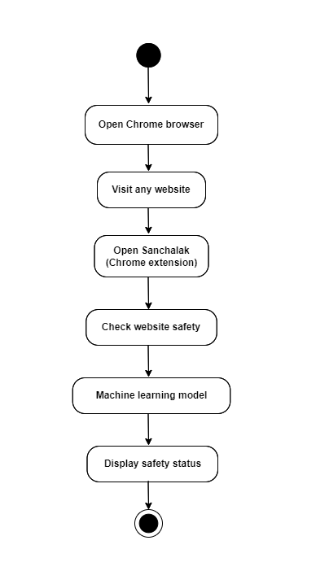
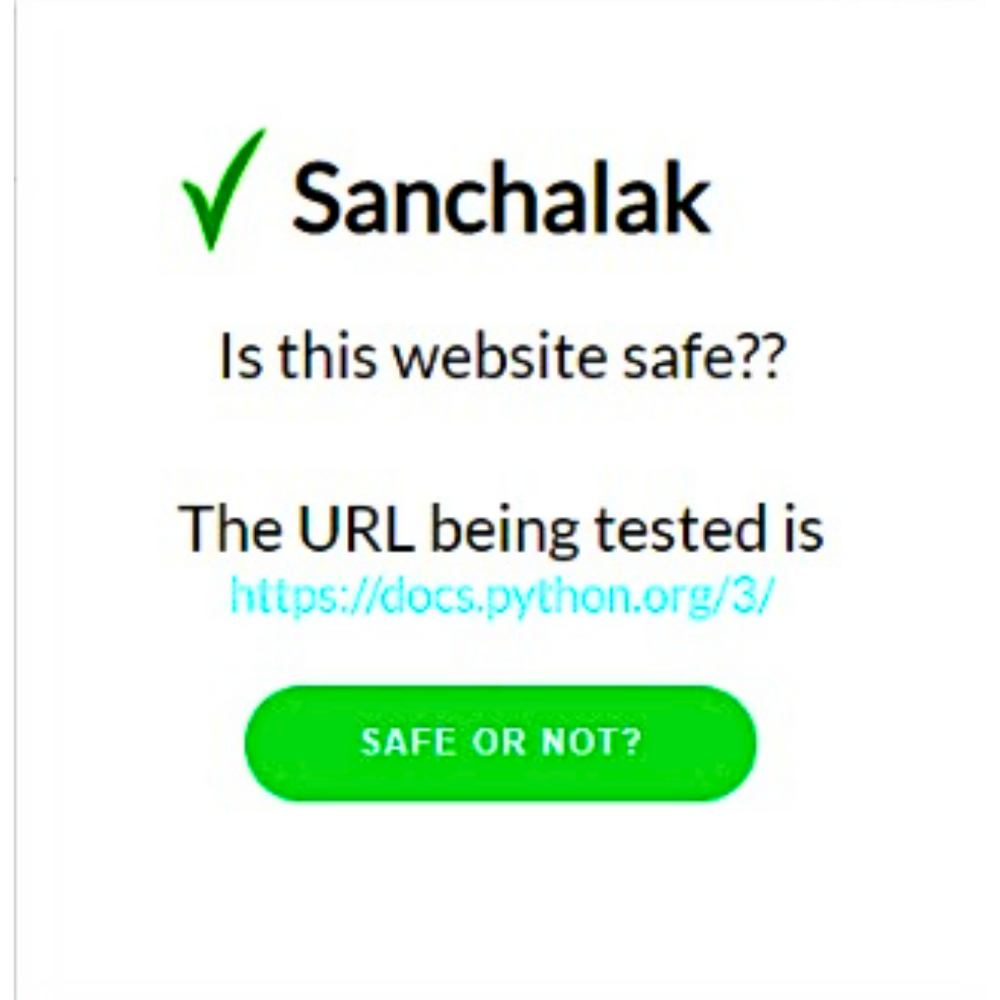
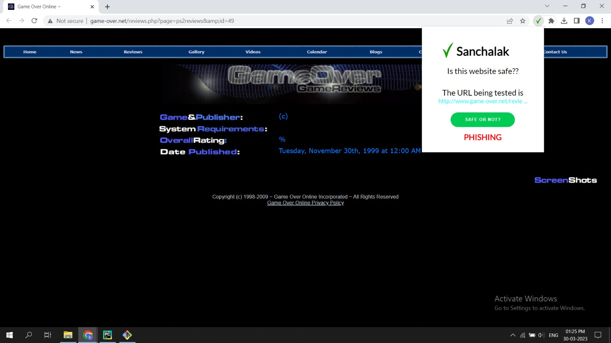

<h1 align="center">
Malicious URL Detection using Machine Learning
  </h1>
  
  

The rise of malicious activities on the World Wide Web poses a threat to users' sensitive information. In 2021, half of all cybercrime victims were targeted by phishing attacks, demonstrating the scale of the problem. The consequences of falling victim to a phishing attack can be severe, including financial loss, identity theft, and reputational damage.    
It is a common misconception that if there is a padlock symbol next to the website URL, the site is always safe. The padlock icon only indicates that the communication between the user's browser and the website is encrypted, which helps protect the data from eavesdropping or interception. Scammers previously didn't bother with digital certificates for fake websites, making them easier to spot. However, scammers have become more sophisticated, using fake certificates or exploiting legitimate sites. While the padlock symbol is helpful, users should verify authenticity through other means like checking the URL and trust indicators.    
 

 

## Features
| Lexical Features     | Host-based Features   | Content-based Features |
|----------------------|-----------------------|------------------------|
| url_of_anchor        | registration_length   | web_traffic            |
| sub_domain           | age_of_domain         | favicon                |
| having_-             | having_ip             | redirect               |
| links_in_tags        | google_index          | submitting_to_email    |
| sfh                  | dns_record            | statistical_report     |
| request_url          |                       | mouse_over             |
| url_length           |                       | iframe                 |
| https_token          |                       | rightclick             |
| shortening_service   |                       |                        |
| having_@             |                       |                        |
| abnormal_url         |                       |                        |
| having_//            |                       |                        |

## Flowchart
 

## Tech Stack

**UI:** HTML5, CSS3.

**Backend:** Python3.

**Libraries:** beautifulsoup4, googlesearch-python, scikit-learn, pandas, requests, whois.

## Screnshots

## Future Scope

The developed model for malicious URL detection exhibits impressive results, but improvement is needed, particularly in reducing the prediction time of 30 seconds for real-time detection. Another area for improvement is to handle situations where a website is down or permission to access it is denied. In such circumstances, the current model cannot predict whether the website is malicious or not. This limitation can be addressed by incorporating additional features that can be extracted from other sources, such as WHOIS data or passive DNS information.
  

